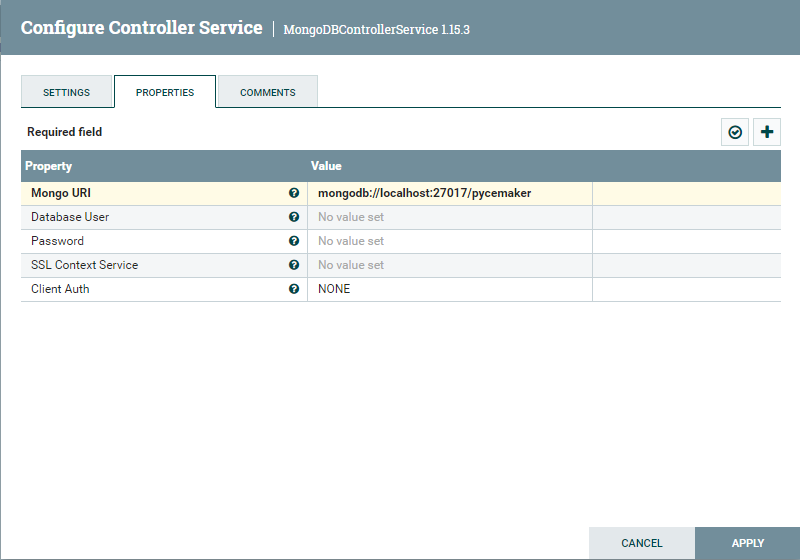
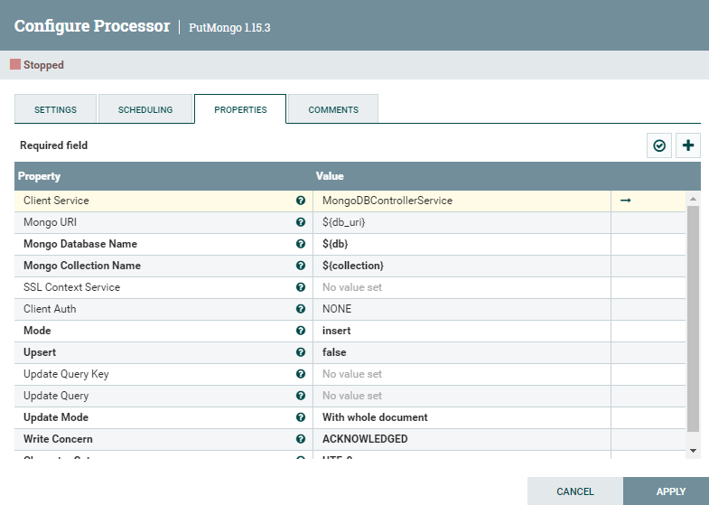
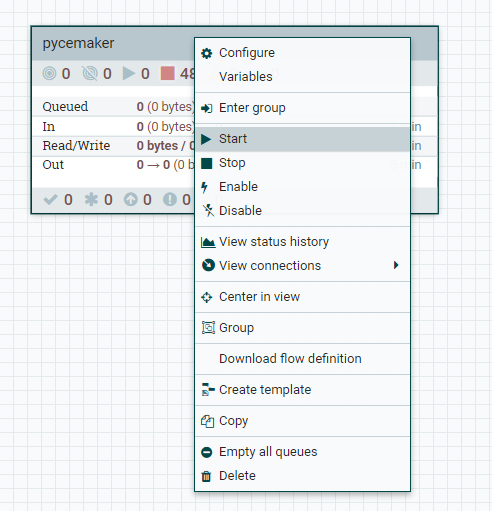

#  🐍 Pycemaker - Repositório do fluxo ETL Pycemaker

O Fluxo ETL Pycemaker é responsável por disponibilizar em Collections do MongoDB os dados estatísticos do consumo de ambiente da Aplicação monitorada.
O Fluxo também realiza o envio de E-mails de alertas de criticidade caso a aplicação esteja consumindo muito do ambiente.

# 📦 Repositórios integrantes do projeto

| Repositório                                                                                   | Descrição                   |
| --------------------------------------------------------------------------------------------- | --------------------------- |
| [pycemaker-docs](https://github.com/pycemaker/pycemaker-docs)                                 | Apresentação e documentação |
| [pycemaker-dashboard-client](https://github.com/pycemaker/pycemaker-dashboard-client)         | Front-End Dashboard         |
| [pycemaker-dashboard-api](https://github.com/pycemaker/pycemaker-dashboard-api)               | API para Dashboard          |
| [pycemaker-dashboard-middleware](https://github.com/pycemaker/pycemaker-etl-flow)             | Pycemaker ETL Flow          |
| [pycemaker-form-client](https://github.com/pycemaker/pycemaker-form-client)                   | Front-End para Formuário    |
| [pycemaker-form-server](https://github.com/pycemaker/pycemaker-form-server)                   | Api para Formuário          |

# ⚙️ Instruções de Instalação e Uso

* **Banco de dados**
    * Baixe e instale o banco de dados MongoDB:
        * [MongoDB Community 5.0.7]("https://www.mongodb.com/try/download/community"); e
        * Crie um Database nomeado "Pycemaker".
* **Nifi**
    * Baixe e instale o ambiente de desenvolvimento Nifi:
        * [Nifi 1.15.3]("https://nifi.apache.org/download.html")

* **Execute a aplicação**
    * Realize a importação do template do fluxo Pycemaker:
        1. Operate;
        2. Upload Template;
        3. Select Template;
        4. Upload;
        5. Template;
        6. Choose Template;
        7. Add. 

      * ### Video demonstrativo:

      * #### Importação do template
         https://user-images.githubusercontent.com/56441534/163399502-5a13cf57-681e-4948-a63d-2c3005122769.mp4
         
      * Atenção: Ao realizar a conexão com o MongoDB, lembre-se de alterar os parametros de conexão para o seu servidor Mongo:
         *  ControllerService:
            * 
         *  PutMongo (Processor):
            * 

   * Por fim, basta executar o Fluxo:
      * 
